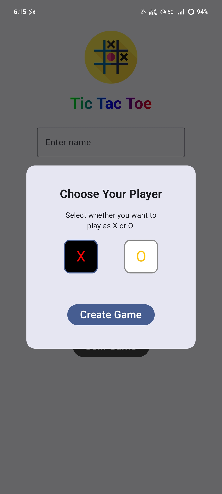

# 🎮 Bluetooth Tic Tac Toe Game (Android)

A peer-to-peer multiplayer game built for Android using Jetpack Compose and Bluetooth communication. Supports offline gameplay over Bluetooth, where one device hosts the game and others join as clients.

## 🚀 Features

- Offline multiplayer over Bluetooth
- Host-client architecture using BluetoothServerSocket and BluetoothSocket
- Real-time state synchronization using socket streams
- Player role assignment and turn-based logic
- Jetpack Compose UI
- Clean Architecture (Domain, Data, Presentation layers)

## 🛠 Tech Stack

- Kotlin
- Jetpack Compose
- Bluetooth Classic (RFCOMM)
- Hilt (for Dependency Injection)
- Coroutines + Flow (for async streams)
- MVVM + Clean Architecture

## 📸 Screenshots

| Host Select Role | Game In Progress | Game Over |
|------------------|------------------|-----------|
|  |  |  |

## 📦 Installation

1. Clone the repo:
    ```bash
    git clone https://github.com/milanmaji/BluetoothTicTacToe.git
    ```

2. Open in Android Studio.

3. Enable required permissions in `AndroidManifest.xml`:
    ```xml
    <uses-permission android:name="android.permission.BLUETOOTH"/>
    <uses-permission android:name="android.permission.BLUETOOTH_SCAN" android:usesPermissionFlags="neverForLocation"
        tools:targetApi="31" />
    <uses-permission android:name="android.permission.BLUETOOTH_CONNECT" />
    <uses-permission android:name="android.permission.BLUETOOTH_ADMIN"/>
    <uses-permission android:name="android.permission.VIBRATE"/>
    ```

4. Run on **two physical Android devices** with Bluetooth turned on.

## 🧩 How It Works

- The **Host** creates a game session and starts a Bluetooth server socket.
- **Clients** discover and connect to the host device.
- The **Host handles game logic**, while clients send their moves.
- Game state is synchronized across devices using Bluetooth message passing.

